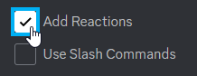

# Discord Bot Challenges
After completing the [code-along](DiscordCodeAlong.md), attempt the challenges below.

## 1. Limit the Bot to a Single Channel
For the following challenges, it will be helpful if your bot sticks to a single channel. Modify the `on_message` event handler so that your bot only responds to messages sent in your specific channel. Then, continue working on the challenges while testing the bot in your channel.

The following documentation pages may be helpful for this challenge:

- [Message](https://discordpy.readthedocs.io/en/latest/api.html#discord.Message)
- [TextChannel](https://discordpy.readthedocs.io/en/latest/api.html#discord.TextChannel)

## 2. Add More Prompts and Responses
Add at least three more prompts and responses to the `responses` dictionary!

1. Add a comma to the end of the _last item_ in the dictionary
1. After the last item on a new line, add a string for a new prompt, followed by a `:`, and then a string for the new response
1. Repeat until there are at least three new items
1. Run the code, and verify that your Discord bot responds to the new prompts!

## 3. Add Prompts and Responses for a Specific User
Add another dictionary of prompts and responses, called `user_responses`. This should be a nested dictionary, where the first level of nesting is keyed by username, and the second level contains the prompts and responses. Then, modify the `on_message` event handler to allow the bot to search `user_responses` dict for the `message.author.name`, and then use the user's specific dictionary of prompts and responses to process the message in the same way the "global" prompts and responses are handled.

If you notice that you are repeating code in the `on_message` event handler, the second part of this challenge is to create a *helper function* and refactor the `on_message` event handler so that no code is duplicated, through the use of the new helper function.

## 4. Randomize Responses
Next, modify your dictionaries of prompts and responses so that some responses are lists of strings, rather than a single string. Then, use `random.choice` to pick a random response from the list so that the bot can have some variation when responding to the same prompt.

You will want to use the [`isinstance`](https://docs.python.org/3/library/functions.html#isinstance) function in the `on_message` event handler (or your helper function) to determine if a particular response is a straight-up string, or a list of strings, to handle the result accordingly.

## 5. Emoji Reactions
In addition to responding with messages, figure out how to allow your bot to _react_ to certain prompts. [Check out this page for more information.](https://discordpy.readthedocs.io/en/stable/faq.html#how-can-i-add-a-reaction-to-a-message)

It may be necessary to go back to the [Discord Developer Portal](https://discord.com/developers/applications/) and generate a new URL for the bot that includes the "Add Reactions" permission:

Copy that URL and re-invite the bot!

## 6. File Uploads
Add the ability to respond with certain messages by sending image files. [Check out this page for more information.](https://discordpy.readthedocs.io/en/stable/faq.html#how-do-i-upload-an-image)

It may be necessary to go back to the [Discord Developer Portal](https://discord.com/developers/applications/) and generate a new URL for the bot that includes the "Attach Files" permission:

Copy that URL and re-invite the bot!
