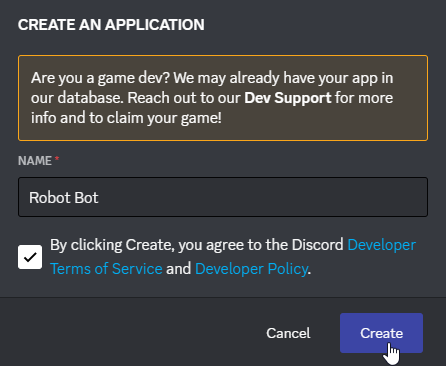
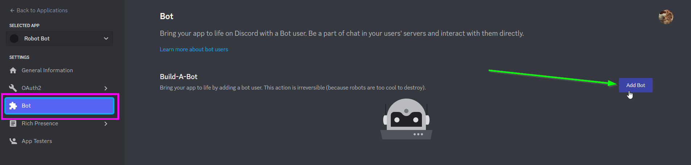
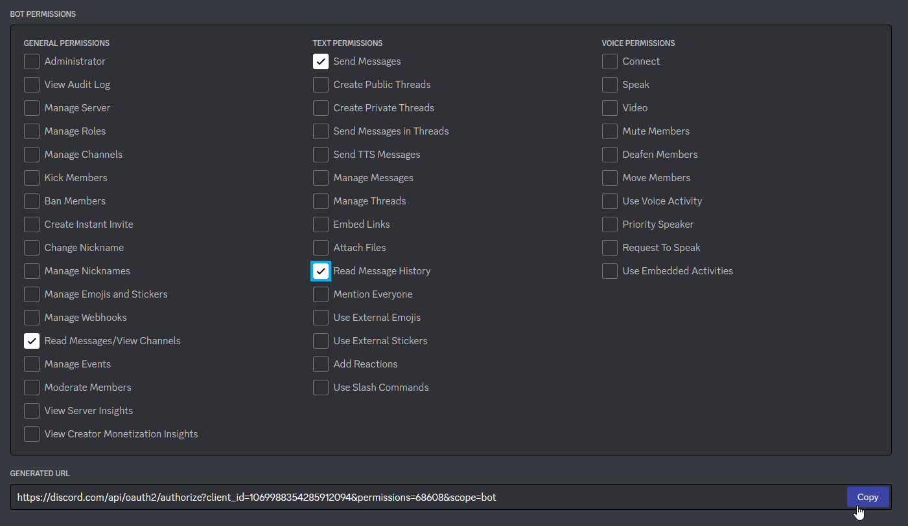
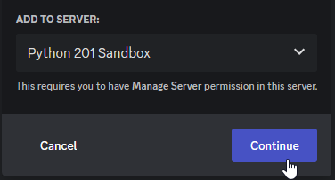
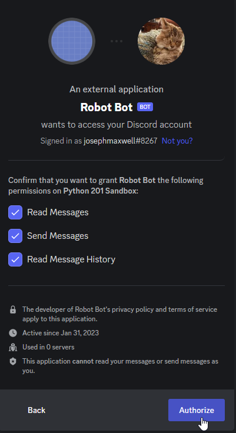
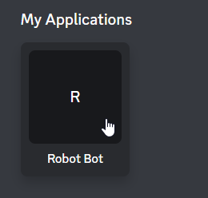
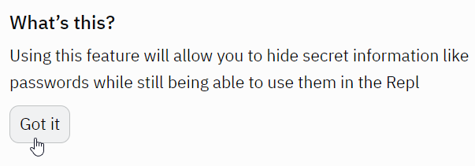
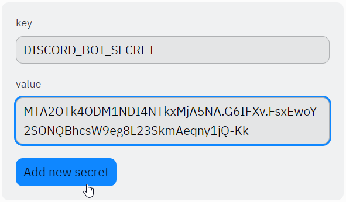

# Discord Chat Bot
In this activity, create a Discord chat bot that can respond to messages in a Discord server. How the chat bot responds and what it says is for you to decide! The chat bot could respond to common phrases, or respond to commands with useful features like rolling dice, posting pictures, or acting as a calculator.

## Part 1: Running the Starter Bot
The most involved part of this activity will be getting the basic bot connected to Discord. This does not involve changing any code - it's all setup. Follow these instructions to join the sandbox server, create the bot application, and hooking up the code.

### Joining the Sandbox Server
[Click here to join the Sandbox Server.](https://discord.gg/ev9t26vu5W)

You will need a Discord account to complete this activity. If you do not have one, you can follow [these instructions](https://hylandtechclub.com/DiscordUse#setup) after clicking the invite link above.

### Creating the Bot Application in Discord
After you've joined the server, you need to create the **Application**. You can create many types of Discord applications, including bots!

1. Go to your [Discord Developer Portal](https://discord.com/developers/applications)
    - Note: you must be logged into Discord in the browser for this
1. Click the "New Application" button in the upper right  
    
1. Enter a unique name for your bot (e.g., "Robot Bot") and click the "Create" button  
    
1. From the menu on the left, click the "Bot" option
1. On that page, click the "Add Bot" button on the right  
    
1. When the pop-up appears, click the "Yes, do it!" button
    

<video width="100%" height="450px" controls>
  <source src="Assets/DoIt.mp4" type="video/mp4">
</video>

Now you have yourself a shiny new bot application!

### Configuring the Bot
The next step is to setup the bot, and prepare it to join the server.

1. On the "Bot" page, scroll down to the "Privileged Gateway Intents" section
1. Toggle the "MESSAGE CONTENT INTENT" option  
    
1. From the menu on the left, click the "OAuth2" option
1. In the sub-menu on the left, click the "URL Generator" option
1. There, check the "bot" checkbox under "SCOPES"  
    
1. In the "BOT PERMISSIONS" sections, select the necessary checkboxes:
    - Read Messages/View Channels
    - Send Messages
    - Read Message History
1. Click the "Copy" button on the right under "GENERATED URL"  
    

This copied link will allow you to invite your bot to any server where you have the "Manage Server" permission!

### Inviting the Bot to the Sandbox Server
Everyone who joins the **Python 201 Sandbox** server should have "Manage Server" permissions, which means everyone should be able to add bots! Follow these steps to add yours.

1. Paste the copied link into your browser
1. In the "ADD TO SERVER" dropdown, select **Python 201 Sandbox**
1. Click the "Continue" button  
    
1. On the next screen, click the "Authorize" button  
    
1. Verify humanity if needed
1. Close the tab

Now, your bot should be in the server! Make sure you see them appear.

### Copying the Token
You'll need one last thing from Discord - your bot's token. Every bot has a secret token that allows developers to log in and write code that uses the application. You can reset and copy the token in the developer portal.

1. Return to the [Discord Developer Portal](https://discord.com/developers/applications)
1. Click on your bot application under "My Applications"  
    
1. From the menu on the left, click the "Bot" option
1. On that page, click the "Reset Token" button under "Build-a-Bot"  
    
1. When the pop-up appears, click the "Yes, do it!" button  
    
1. When the token appears, click the "Copy" button under it  
    

With that token, you will be able to connect to Discord with your bot!

### Updating and Running the Repl
There is a starter Repl project with some basic bot code. Add your secret token and run the bot!

1. Open and fork the [starter Repl project](https://replit.com/@HylandOutreach/DiscordBot#main.py)
1. On the left, in the "Tools" section, click the "Secrets" button  
    
1. If this is your first time using Secrets, click the "Got it" button  
    
1. On the next screen, enter "DISCORD_BOT_SECRET" in the "key" field
1. Paste your copied secret token in the "value" field
1. Click the "Add new secret" button  
    
1. Click the "Run" button to bring the bot to life

In the console, a `Logged in as:` message should appear - that means the bot is online!

### Testing the Bot
With the bot up and running, you should be able to test it out!

1. Go to Discord
1. Verify that your bot appears as "ONLINE" in the server
1. Go into your specific channel
1. Post any message
1. Go back to the Repl project, and make sure the message author and content appeared in the console
1. Go back to Discord, and send "ping"
1. Verify that the bot responds with "pong"

That's just about all the bot can do at the moment, but it lays the groundwork for a much more powerful application.

## Part 2: Reviewing the Starter Code
Before attempting to update the bot, it may be helpful to understand what the code is already doing.

### Imports
The first couple lines use `import` to pull in some helpful libraries:

- The [`discord`](https://discordpy.readthedocs.io/en/stable/) library wraps the Discord API and allows code to interact with Discord
- The [`os`](https://docs.python.org/3/library/os.html) library allows code to interact with the operating system

```py
import discord
import os
```

### Intents
The next couple lines create the "intents" object for the bot - this object tells the Discord API what the bot should be able to do. In this case, the bot needs the ability to access the content of messages, so the `message_content` property is set to `True` - everything else is kept default.

```py
intents = discord.Intents.default()
intents.message_content = True
```

### Client Creation
The next line uses the `discord` library to create the client - this is the intermediary between the code and the API. It passes in the `intents` object so it knows what it should be able to do.

```py
client = discord.Client(intents=intents)
```

### `on_ready` Function
The next few lines define the `on_ready` function, which is wrapped by the `@client.event` decorator. The decorator tells the `client` object that this function should be used when responding to an event - specifically, the `on_ready` event.

The function is marked `async` because it must be able to be run dynamically based on the events sent from the Discord API.

When the client has successfully logged into the server, this function prints a message with the bot's username.

```py
@client.event
async def on_ready():
  print(f"Logged in as: {client.user}")
```

### `on_message` Function
The next several lines define the `on_message` function. It has the `@client.event` decorator so that it can run when a new message appears in the server. It takes in a `message` object as a parameter, and then responds appropriately based on the message `author`, `channel`, and `content`.

It is marked `async` so that it can respond to multiple messages without freezing up.

The function does a few different things.

```py
@client.event
async def on_message(message):
```

#### Author Check
The function will immediately return if the new message is coming from a bot.

```py
if message.author.bot:
  return
```

#### Print
If the message is not from a bot, the function will print out the content of the message, along with the author, using an f-string.

```py
print(f"Message from {message.author}: {message.content}")
```

#### Prompt Response
Finally, the fun part - the function will check the content of the message. For now, it only responds if `message.content` is `"ping"`. In that case, it uses `message.channel.send` to send `"pong"` back in the same channel.

The `await` keyword is used in front of the `send` function because it needs to go through the internet to reach the Discord API - that can take a while.

```py
if message.content == "ping":
  await message.channel.send("pong")
```

### Secret Token Retrieval
After the `on_message` function definition, the next line retrieves the secret token from the Repl. It uses the `os` library to access the system's environment variables (the `environ` object), and then finds the `"DISCORD_BOT_SECRET"` value - this is the one set in the **Secrets** for the project.

```py
token = os.environ["DISCORD_BOT_SECRET"]
```

### Run!
After all the setup, the last line actually runs the client using the secret token to log in!

```py
client.run(token)
```

## Part 3: Updating the Bot Code
The bot code does quite a bit, but it could do quite a bit more. Update it so that it responds to more messages!

### Prompts & Responses: Refactoring
You could add more hard-coded `if` statements to make the chat bot more responsive, but what if it needs to respond to hundreds of phrases? Or what if you need to add more prompts and responses on-the-fly? Dictionaries can solve this problem! Add a dictionary with prompts as keys and responses as values to lay the groundwork for a more functional chat bot.

1. At the top of the **main.py** file, right after the line that creates the `client` variable, create a new variable called `responses`
1. Set `responses` to a new dictionary `{}`
1. Add a key of `"ping"` with a value of `"pong"`

```py
responses = {
  "ping": "pong"
}
```

### Checking for the Prompt
Now, the `responses` dictionary can be used by the `on_message` event handler. By using the `in` keyword, it will be simple to check if the user has sent a message that matches one of the keys from the dictionary.

1. Find the bottom of the `on_message` function
1. Find the `if message.content == "ping"` statement
1. Instead of checking if `content` is `"ping"`, check if it is `in` the `responses` dict
1. In the body of the `if`, remove the `"pong"`
1. Replace it with the proper response: the value of the `responses` dict for a key of `message.content`

The updated `if` statement should look something like this:

```py
if message.content in responses:
  await message.channel.send(responses[message.content])
```

Re-run the project, and make sure the "ping" message still receives the "pong" response!

### Adding More Prompt/Response Pairs
The next step is to simply fill out the `responses` dictionary object with more responses! Keep it mind that it is possible to use emoji like `:smile:`. You can use whatever (appropriate) prompts and responses you want, but make sure to add **at least three more**.

Your `responses` object could end up looking something like this:

```py
responses = {
  "ping": "pong",
  "hi": "howdy :cowboy:",
  "sup": "yo :sunglasses:",
  "how are you?": "i am incapable of emotion :no_mouth:"
}
```

### Testing the Bot (Again)
You can test your bot by writing messages that match your prompts. Make sure to post in your specific channel so it doesn't get too annoying. If your bot shows as offline, it's possible that your Repl has timed out - if that's the case you may need to refresh your Repl and re-run it. Your bot should then show up as online again.

## Conclusion
By the end of this activity, you should have been able to create a fun and functional conversational bot. The code should look something like this:

```py
# import libraries to use
import discord
import os

# setup bot intents - allow to read messages
intents = discord.Intents.default()
intents.message_content = True

# create client with intents
client = discord.Client(intents=intents)

# dictionary of responses
responses = {
  "ping": "pong",
  "hi": "howdy :cowboy:",
  "sup": "yo :sunglasses:",
  "how are you?": "i am incapable of emotion :no_mouth:"
}

# print message when client is online
@client.event
async def on_ready():
  print(f"Logged in as: {client.user}")

# respond to incoming messages
@client.event
async def on_message(message):
  # don't do anything if the message comes from a bot
  if message.author.bot:
    return

  # print the incoming message
  print(f"Message from {message.author}: {message.content}")

  # send a response to a particular message
  if message.content in responses:
    await message.channel.send(responses[message.content])

# get token from secret
token = os.environ["DISCORD_BOT_SECRET"]

# run the bot!
client.run(token)
```

Remember, the code won't work unless you have the bot application setup in Discord, and have the proper token stored in the Repl's Secrets.

## Next Steps
The actual Discord setup may have been tedious and challenging, but now that that's out of the way, you should feel empowered to create any type of bot you would like! This lesson only scratches the surface of what's possible with the Discord API and the discord.py library.

Feel free to continue working on your bot as you see fit, or check out the [challenges](DiscordChallenges.md) for some ideas.
